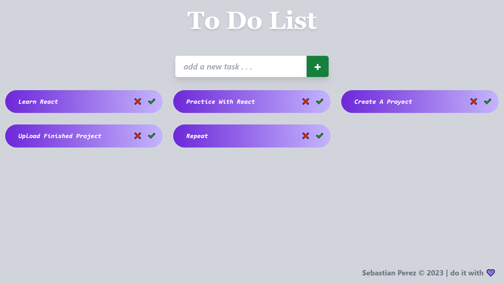

### EN 🌏
<h1 align=center>PROYECT : <strong>ToDo List</strong></h1>

State : <strong>Finished</strong>

 

## DESCRIPTION :
 

## The project is a form in which we can add pending tasks to be carried out. And then we can mark the completed tasks and finally we can give it as finished, which will remove it from the list 
  

##  FUNTIONALITIES : 

<strong>✔️ Add tasks news</strong> 
<strong>✔️ Organize your time</strong> 
<strong>✔️ Mark completed tasks</strong> 
<strong>✔️ Delete from the list some task</strong> 
<strong>✔️ take control of your day</strong> 

<video src="./public/example.mp4" width="600" height="400" autoplay muted loop></video>

## APPLIED TECHNOLOGIES :
 
<li><b>HTML</b></li>
<li><b>CSS</b></li>
<li><b>REACT.JS</b></li>
<li><b>JAVASCRIPT</b></li>
<li><b>TAILWINDCSS</b></li>

 

## DEVELOPED BY :

Sebastian Perez - front end dev
